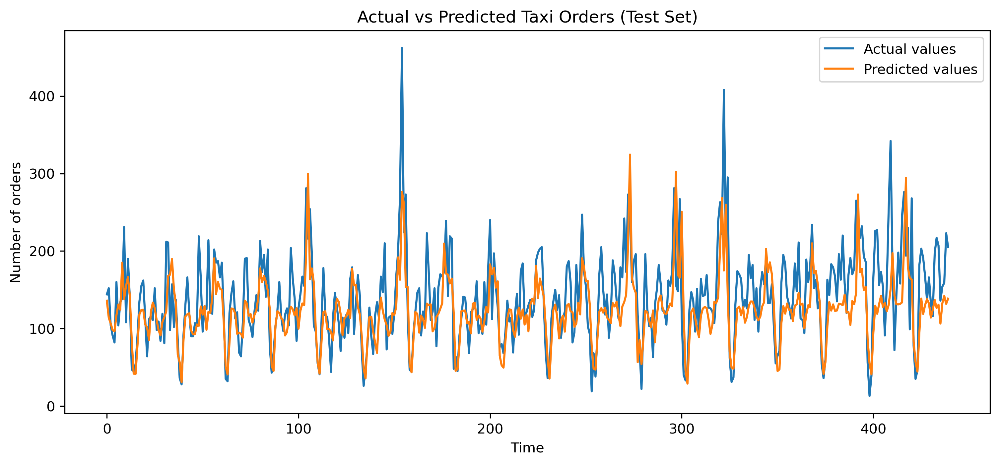

# Taxi Demand Forecasting (Time Series)

## Project Overview
This project focuses on forecasting the number of taxi orders for the **next hour** using
historical data and machine learning techniques. The goal is to help a taxi company anticipate
demand during peak hours and allocate drivers more efficiently.

## Dataset
- Original frequency: every 10 minutes  
- Resampling: hourly intervals  
- Target variable: `num_orders`

## Methodology
1. Data preparation and hourly resampling
2. Exploratory data analysis of the time series
3. Feature engineering:
   - Lag features
   - Rolling means
   - Time-based features (hour, day of week)
4. Model training:
   - Baseline model
   - Linear Regression
   - Random Forest
5. Model evaluation using RMSE

## Results
- Best performing model: **Random Forest**
- RMSE on the test set: **≤ 48**, meeting the project requirement

## Technologies
- Python
- Pandas
- NumPy
- Scikit-learn
- Matplotlib

- ## Predicción vs valores reales

